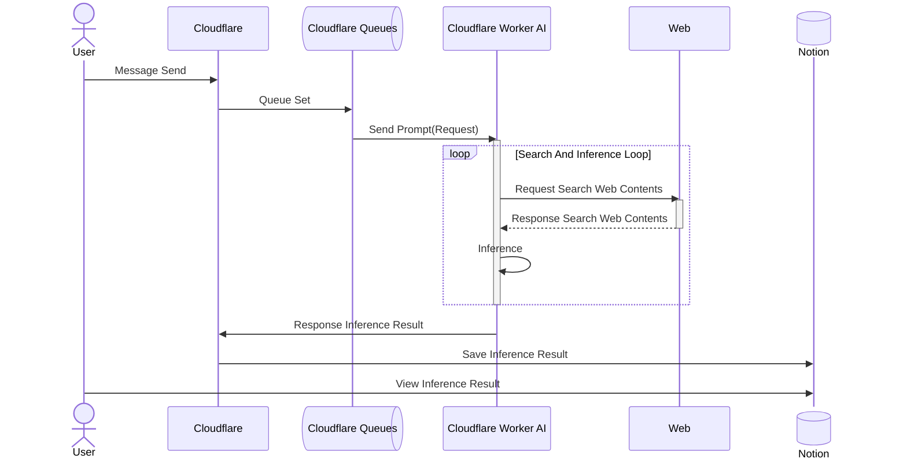

# Netz
AIによる情報収集によるナレッジ収集

```mermaid
sequenceDiagram
    actor U as User
    participant C as Cloudflare
    participant CQ@{ "type" : "queue" } as Cloudflare Queues
    participant CWI as Cloudflare Worker AI
    participant W as Web
    participant N@{ "type": "database" } as Notion

    U ->> C: Message Send 
    C ->> CQ: Queue Set
    CQ ->> CWI: Send Prompt(Request)

    activate CWI

    loop Search And Inference Loop
        CWI ->> W: Request Search Web Contents
        activate W
        W -->> CWI: Response Search Web Contents
        deactivate W

        CWI ->> CWI: Inference
    end

    deactivate CWI

    CWI ->> C: Response Inference Result

    C ->> N: Save Inference Result
    U ->> N: View Inference Result

```